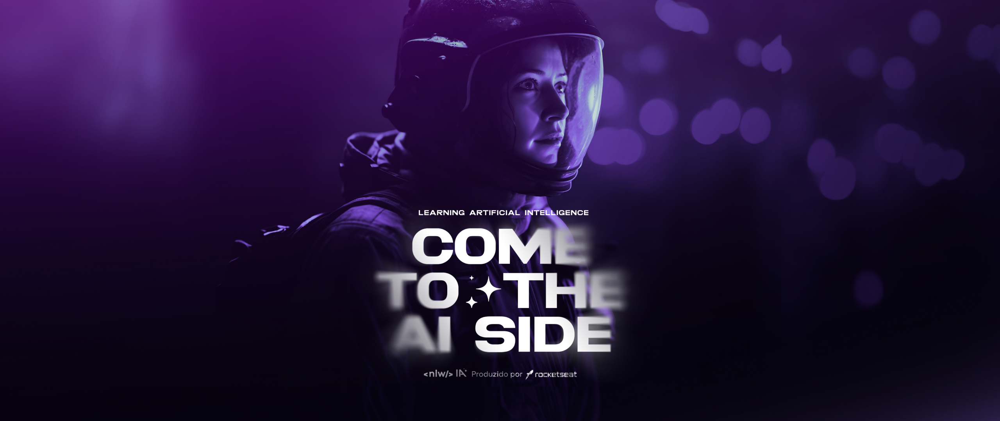

# NLW 13 Upload.AI

## O Projeto NLW IA Mastery Upload.ai

O projeto NLW IA Mastery Upload.ai é uma aplicação web desenvolvida em um evento patrocinado pela Rocketseat chamado NLW IA. Ele combina diversas tecnologias de ponta para converter vídeos em áudio, transcrever o conteúdo, e gerar automaticamente títulos e descrições para vídeos no YouTube. Essa aplicação é um excelente exemplo de como a Inteligência Artificial pode ser aplicada para melhorar a produtividade e eficiência em tarefas cotidianas.

## Tecnologias utilizadas

### BACK-END

- [Node.js](https://nodejs.org/): É uma plataforma que permite a execução de JavaScript no servidor.
- [Prisma:](https://prisma.io/) Um ORM (Object-Relational Mapping) moderno para Node.js e TypeScript.
- [Fastify](https://fastify.io/): Um framework web rápido e eficiente para Node.js.
- [TypeScript](https://www.typescriptlang.org/): Uma linguagem que adiciona tipos ao JavaScript, facilitando o desenvolvimento.
- [OpenAI](https://openai.com/): A plataforma que fornece a capacidade de integração com modelos de linguagem, como o ChatGPT.

### FRONT-END

- [Vite.js](https://vitejs.dev/): Um construtor de aplicativos web rápido e elegante.
- [TypeScript](https://www.typescriptlang.org/): Continuamos usando TypeScript para o frontend para consistência.
- [Tailwind CSS](https://tailwindcss.com/): Um framework de CSS altamente personalizável e fácil de usar.
- [FFmpeg](https://www.ffmpeg.org/): Uma poderosa ferramenta para manipulação de áudio e vídeo.
  FFmpeg
- [shadcn/ui](https://ui.shadcn.com/): Biblioteca para criação de interfaces de usuário elegantes.
- [Axios](https://axios-http.com/): Uma biblioteca para fazer requisições HTTP.

## Funcionalidades da Aplicação

### - FRONT-END

O Frontend da aplicação é responsável por converter vídeos em áudio, enviar o áudio para o Backend junto com prompts específicos e configurações. Ele aguarda o retorno do Backend contendo título, descrição e transcrição do áudio, que podem ser usados para postagens de vídeos no YouTube.
Nota: Não necessariamente na ordem descrita.

### - BACK-END

O Backend recebe a requisição do Frontend, envia o áudio para o ChatGPT, que realiza a transcrição e gera o título do vídeo e uma descrição com base no prompt informado.

## Clonando e Executando a Aplicação

1. Clone o repositório do GitHub usando o comando:

```bash
git clone https://github.com/jadilson12/nlw-ia-mastery-upload.ai.git
```

2. Navegue para o diretório raiz do projeto:

```bash
cd nlw-ia-mastery-upload.ai
```

3. Instale as dependências do Backend (pnpm e npm são opções):

```bash
cd api
pnpm install
# ou
npm install
```

4. Instale as dependências do Frontend (pnpm e npm são opções):

```bash
cd web
pnpm install
# ou
npm install
```

5. Certifique-se de configurar as variáveis de ambiente necessárias para o projeto.
6. Execute o Backend:

```bash
cd api
pnpm start
# ou
npm start
```

7. Execute o Frontend:

```bash
cd web
pnpm dev
# ou
npm run dev
```

**Agora a aplicação deve estar rodando localmente.**

## NOTAS

**Vantagens do pnpm e npm**:
Tanto pnpm quanto npm são gerenciadores de pacotes populares para JavaScript. No entanto, o pnpm oferece algumas vantagens notáveis em relação ao npm:

- **Economia de Espaço**: O pnpm adota uma abordagem de links simbólicos para compartilhar dependências entre projetos, economizando espaço em disco. Isso significa que as dependências são armazenadas apenas uma vez no sistema, independentemente do número de projetos que as utilizam.

- **Velocidade**: O pnpm é conhecido por ser mais rápido na instalação e gerenciamento de pacotes. Isso é devido ao seu uso eficiente de cache e à estratégia de links simbólicos.

- **Gerenciamento de Dependências Globais**: O pnpm facilita o gerenciamento de dependências globais de forma mais controlada, reduzindo conflitos de versões globais.

- **Integração com Outros Gerenciadores**: O pnpm é compatível com pacotes npm e Yarn, o que permite usar pacotes de qualquer um desses ecossistemas.

## Instalações de ferramentas utilizadas

**Tutorial de Instalação do Node.js e VSCode**
Se você ainda não possui o Node.js e o VSCode instalados, siga os seguintes tutoriais:

**Instalando o Node.js:**

- Acesse o site oficial do [Node.js](https://nodejs.org/).

- Baixe a versão LTS (Long Term Support) recomendada para a sua plataforma (Windows, macOS, Linux).

- Siga o assistente de instalação para configurar o Node.js em seu sistema.

**Instalando o VSCode:**

- Acesse o site oficial do [Visual Studio Code](https://code.visualstudio.com/).

- Baixe a versão compatível com o seu sistema operacional.

- Execute o arquivo de instalação e siga as instruções para concluir a instalação.

_Agora você está pronto para clonar, executar e explorar o projeto NLW IA Mastery Upload.ai!_
